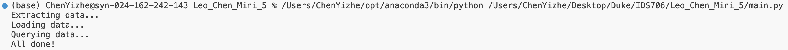

## Leo Chen Mini 5

[](https://github.com/nogibjj/Leo_Chen_Mini_5/actions/workflows/cicd.yml)

### File Structure
```
Leo_Chen_Mini_5/
├── .devcontainer/
│   ├── devcontainer.json
│   └── Dockerfile
├── .github/
│   └── workflows/cicd.yml
├── .gitignore
├── run.png
├── data/
│   └── US_births.csv
├── Dockerfile
├── LICENSE
├── main.py
├── Makefile
├── mylib/
│   ├── extract.py
│   ├── query.py
│   └── transform_load.py
├── README.md
├── requirements.txt
├── US_births_DB.db
├── setup.sh
└── test_lib.py
```

## Purpose
The goal of this project is to build an ETL-Query pipeline. I used one of FiveThirtyEight's public datasets, extracted it into a local CSV file, loaded it into a .db file, and queried it using SQLite.

## Data Source
U.S. births data for the years 2000 to 2014, as provided by the Social Security Administration

Header | Definition
---|---------
`year` | Year
`month` | Month
`date_of_month` | Day number of the month
`day_of_week` | Day of week, where 1 is Monday and 7 is Sunday
`births` | Number of births

[Link to data source](https://github.com/fivethirtyeight/data/blob/master/births/US_births_2000-2014_SSA.csv)

## CRUD Operations
Operations can be found [here](https://github.com/nogibjj/Leo_Chen_Mini_5/blob/main/mylib/query.py)
1. Create: `create a new record: 2024, 10, 5, 6, 7785`
2. Read: `read all data`
3. Update: `update record 55: births = 7899`
4. Delete: `delete record 420`

## Example Run


## References
https://github.com/nogibjj/sqlite-lab
